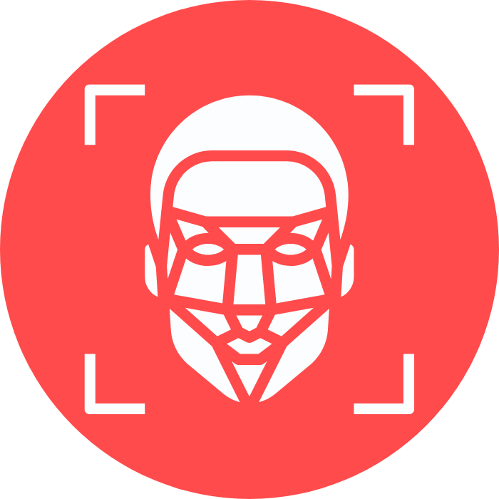

# Imagine AI [[Live Deployment]](https://share.streamlit.io/hardly-human/imagine-ai/main/app/app.py)


> This App implements functionalities of 5 Image recognition APIs built with machine learning & deep learning.

## Installing / Getting started

```shell
git clone https://github.com/Hardly-Human/Imagine-AI
cd Imagine-AI
pip install -r requirements.txt
streamlit run app.app.py
```

## Features

This Project is Built with streamlit (Frontend) and Python (Backend).

-   The Frontend of the Application is built with [streamlit](https://streamlit.io). { A Python package that turns data scripts into shareable web apps }
-   It uses open-cv and pillow to interpret image data.
-   It implements Machine Learning API's with requests package to retrive model data.

## Links

-   Project homepage: https://share.streamlit.io/hardly-human/imagine-ai/main/app/app.py
-   Repository: https://github.com/Hardly-Human/Imagine-AI
-   Issue tracker: https://github.com/Hardly-Human/Imagine-AI/issues
    -   In case of sensitive bugs like security vulnerabilities, please contact
        rehanuddin1024@gmail.com directly instead of using issue tracker. We value your effort
        to improve the security and privacy of this project!
-   Related projects:
    -   Yolo Object Detector: https://github.com/Hardly-Human/Yolo-Object-Detector
    -   Cryptocurrency UniCoin: https://github.com/Hardly-Human/My_Cryptocurrency_UniCoin

## Demo

https://user-images.githubusercontent.com/32925391/132726120-e993955e-06e3-4959-b84b-2d0159a15a69.mp4
